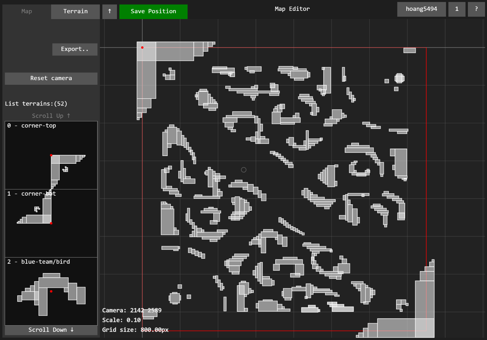

# [DEPRECATED] LOL2D-MapEditor

Tool này giờ không dùng để tạo map cho LOL2D nữa, do đã thay đổi cách tạo bản đồ từ hình chữ nhật (rectangle) sang đa giác (polygon).

Repo này sẽ được giữ lại để có thể tham khảo các chức năng như: UI(button, scroll list items hoàn toàn bằng p5js), firebase realtime database, drag mouse events, camera zoom/scale, ...

Một công cụ online giúp tạo bản đồ cho game LOL2D-Core

Link [Demo](https://lol2d.github.io/LOL2D-MapEditor/)

## Screenshot

